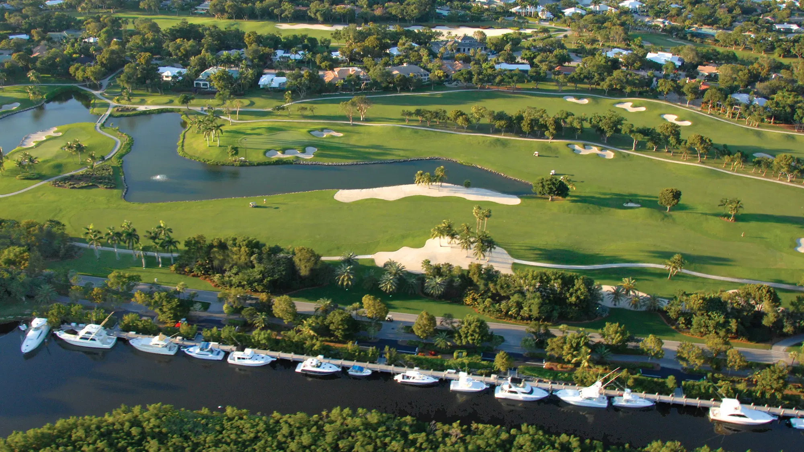

<section class="main-content-container">
  

Gatehouse Docks Condominium Association, Inc. was first incorporated in 1986 under Florida law as a non-profit.  The Docks, located at Ocean Reef Club on North Key Largo, consists of 28 individual parcels, ranging in size from 36 feet, 48 feet, and 60 feet.   
The “A” docks are unrivaled at Ocean Reef, designed for both day cruisers and stay-a-boards, and offer a private destination away from the hubbub of the Main Marina. The location of the docks on the Ocean Reef property provides the closest docks to the Member’s Fitness Center, and the Fishing Village, with the Golf Clubhouse and its fine dining for Ocean Reef Members just across the street.  Our Association’s docks provide our owners with a secure and low-traffic destination for their yachts.   
In 2023, the Association voted to replace aging wooden docks with floating docks designed and installed by Bellingham Marine, the world’s premier floating dock contractor.  The floating docks were installed off-season in 2025.  At the same time, with the encouragement from Ocean Reef Community Association (ORCA) and the Ocean Reef Club, the Association took the opportunity to upgrade its facilities to match the standards set by Ocean Reef.     
New lighting and power pedestals, brick pavers for parking in owner reserved spots just steps away from one of ten gangways serving the docks, new parking areas for golf carts adjacent to car parking, indigenous trees, with new plants and shrubby designed to blend with the Ocean Reef Standard, two state-of-the-art power distribution centers, and all new water, sewer, power and wireless internet infrastructure combine to make the “A” docks of the Condominium Association Ocean Reef’s premier dock space.      
  

  

    
  

</section>
